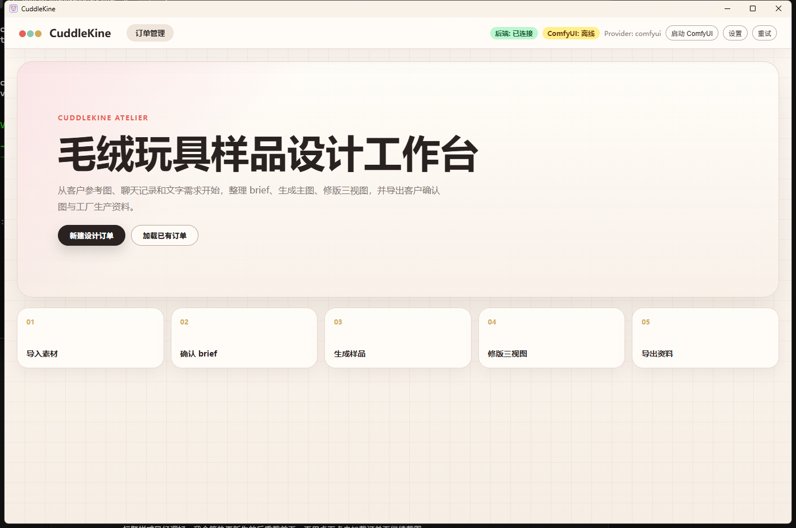
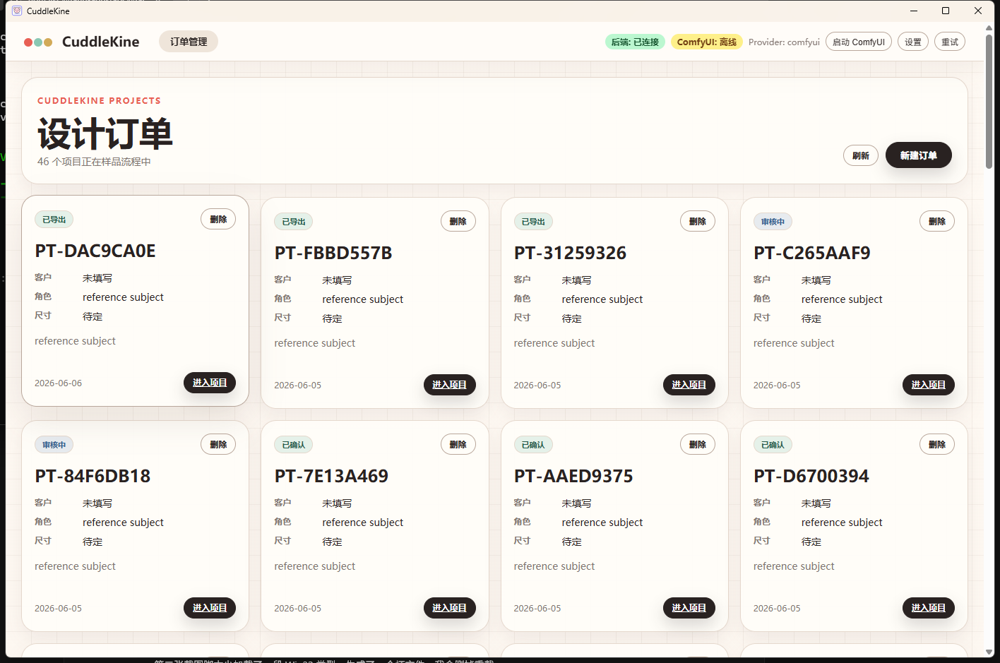
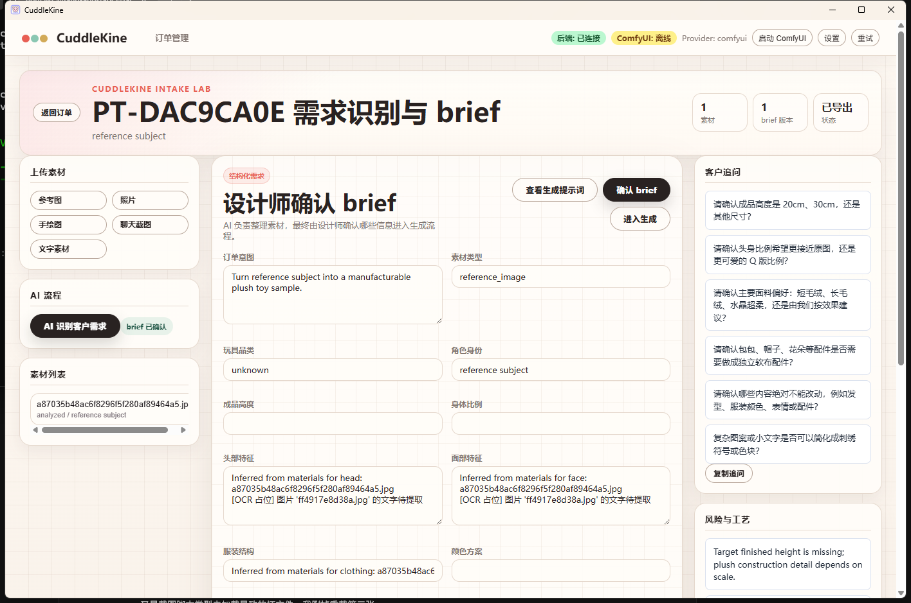
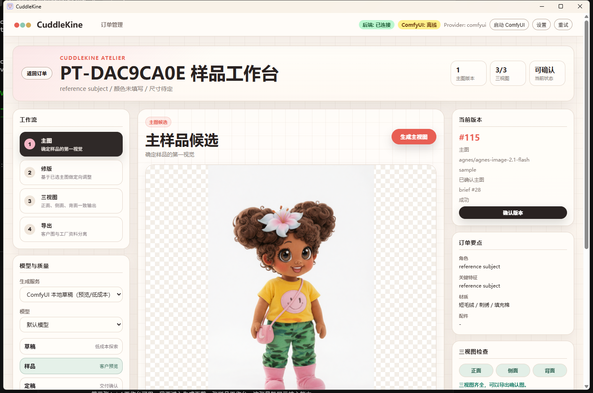

# CuddleKine

CuddleKine is a desktop AI workbench for plush toy sampling. It helps plush toy designers, small studios, and factory teams turn customer briefs and reference images into manufacturable plush sample images, revision versions, front/side/back views, customer confirmation boards, and factory handoff PDFs.

The app combines a Tauri desktop shell, a React design workbench, a FastAPI backend, SQLite storage, and pluggable image providers such as ComfyUI, OpenAI image models, Replicate, and Agnes. For cloud providers that need a public image URL, CuddleKine can upload local references to Tencent Cloud COS and pass temporary signed URLs to the model.

## Screenshots









## Highlights

- Order-based plush toy sampling workflow
- Reference image, sketch, screenshot, photo, and text material intake
- AI-assisted structured brief extraction and designer confirmation
- Provider selection with local and cloud models
- OpenAI / Agnes / Replicate / local ComfyUI configuration
- Tencent Cloud COS image bridge for Agnes image-to-image reference input
- Main sample generation with short designer-led prompts
- Front / side / back multi-view generation
- Brush-mask local revision for a single view
- Customer confirmation image export
- Factory production PDF export with optional fields hidden when empty
- Factory ZIP handoff with PDF, images, brief JSON, and metadata
- Local desktop app powered by Tauri

## Tech Stack

- Frontend: React 19, Vite, TypeScript
- Desktop: Tauri 2
- Backend: FastAPI, SQLAlchemy, SQLite
- Image tooling: Pillow
- Local generation: ComfyUI workflows
- Cloud generation: OpenAI image API, Agnes API, Replicate API
- Cloud image bridge: Tencent Cloud COS signed URLs

## Project Structure

```text
backend/              FastAPI backend service
backend/app/routes/   API routes for orders, materials, generation, export, settings
backend/app/services/ Provider adapters and image processing services
comfyui/workflows/    ComfyUI workflow templates
desktop/              React + Tauri desktop app
docs/                 Product notes, blog draft, screenshots
```

## Requirements

- Node.js 20+
- Python 3.12+
- Rust and Cargo
- Optional: local ComfyUI installation
- Optional: OpenAI API key
- Optional: Agnes API key
- Optional: Replicate API token
- Optional: Tencent Cloud COS bucket and SecretId/SecretKey for Agnes reference-image generation

## Quick Start

Install frontend dependencies:

```powershell
cd desktop
npm install
```

Install backend dependencies:

```powershell
cd ..
python -m venv .venv
.\.venv\Scripts\activate
pip install -r backend\requirements.txt
```

Run the desktop app:

```powershell
cd desktop
npm run tauri dev
```

The Tauri app starts the local backend automatically when possible. During development, the backend API uses `http://127.0.0.1:8765`.

## Provider Setup

Open the CuddleKine desktop app and click **Settings** in the top status bar.

You can configure:

- Default provider
- Default model
- Default quality mode
- Transparent background preference
- OpenAI API key
- Agnes API key
- Replicate API token
- Tencent Cloud COS SecretId / SecretKey
- Tencent Cloud COS bucket and region
- ComfyUI API URL
- ComfyUI input directory

API keys are stored locally in `data/provider_settings.json`. This file is ignored by Git.

### Tencent COS for Agnes Image-to-Image

Agnes can use reference images when the image is available as a cloud-accessible URL. Since CuddleKine is a local desktop app, uploaded references first live on the user's machine. The COS bridge solves this by:

1. Uploading the selected local reference image to a private Tencent Cloud COS bucket.
2. Creating a temporary signed URL.
3. Passing that URL to Agnes `img2img`.

Recommended COS settings:

```text
Bucket: cuddlekine-images-<appid>
Region: ap-guangzhou or ap-shanghai
Access: private read/write
Signed URL expiry: 3600 seconds
```

## Workflow

1. Create an order.
2. Upload reference images, photos, sketches, screenshots, or text.
3. Let AI extract a structured brief.
4. Let the designer confirm or edit the brief.
5. Generate the main plush sample image.
6. Confirm the main version.
7. Generate front / side / back views.
8. Use brush-mask revision for individual view fixes.
9. Export a customer confirmation image or factory production PDF/ZIP.

## Security Notes

Never commit:

- `data/provider_settings.json`
- SQLite databases in `data/`
- generated images in `outputs/`
- API keys or tokens

If a token was pasted into a public issue, chat, or commit, revoke it from the provider dashboard and create a new one.

## Development Checks

Backend syntax check:

```powershell
python -m compileall backend\app
```

Frontend build:

```powershell
cd desktop
npm run build
```

Tauri Rust check:

```powershell
cd desktop\src-tauri
cargo check
```

## Roadmap

- Cost tracking per provider
- Better model capability scoring
- Stronger view-to-view consistency review
- Factory material specification templates
- Optional cloud deployment for team collaboration

## License

No open-source license has been selected yet.
